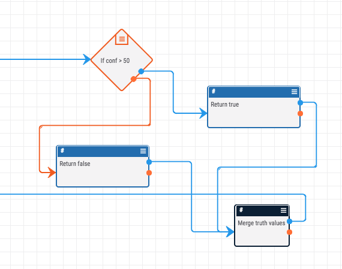
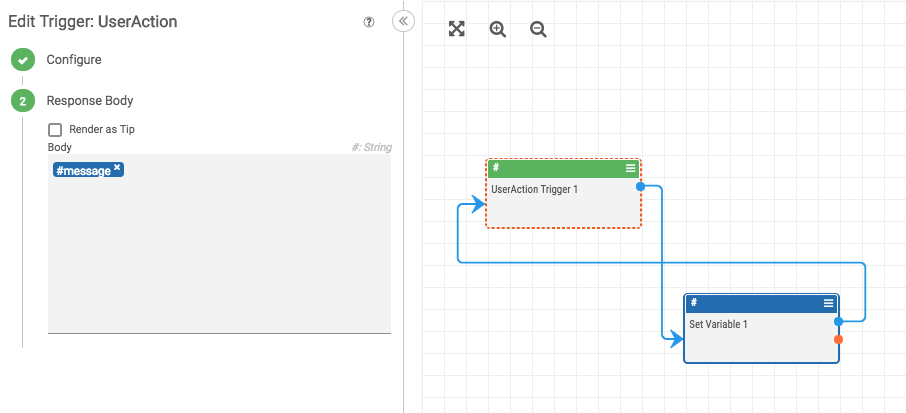
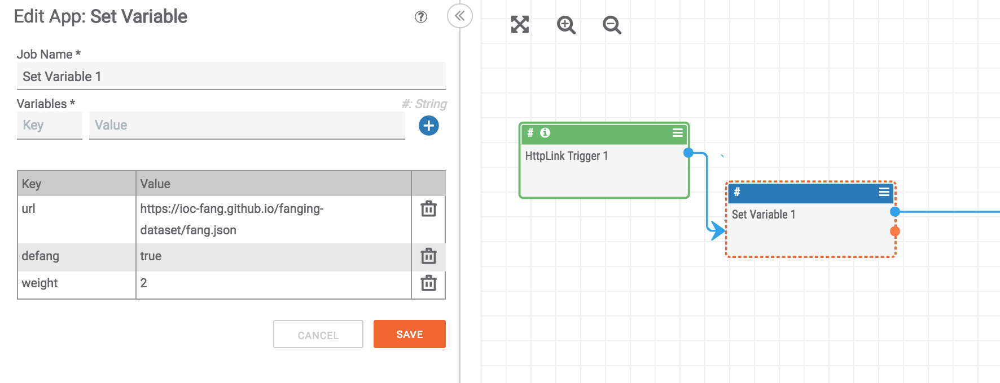

# ThreatConnect Playbook Constructs

Helpful constructs and paradigms for building [playbooks](http://kb.threatconnect.com/customer/en/portal/articles/2744775-playbooks) in [ThreatConnect](https://app.threatconnect.com).

## If-Merge

This construct consolidates the output of an "If" operator so that a value is available to a down-stream playbook regardless of the value returned by the "If" operator.

## Trigger Passback

Values can be passed from a playbook back to the response. This is especially helpful for user-action triggers and http link triggers.

## Variable Initialization

It is a good idea to have a "Set Variable" app near the beginning of your playbook so you can easily manage the variables used throughout the playbook. Doing this one, small step can save you a lot of time in the long run if you need to add or update variables later.

## HTTP Client Response Handling

The "HTTP Client" app is extremely powerful as it provides you access to any internet facing service. When using this app, it is important to keep in mind that if the app receives a response from the requested URL (even if that response is an error code) it will pass the response out on the blue line. As such, it is often important to include an "If" operator after an HTTP Client to filter out responses with error codes from those which were successful. Here is a helpful construct to do this:

