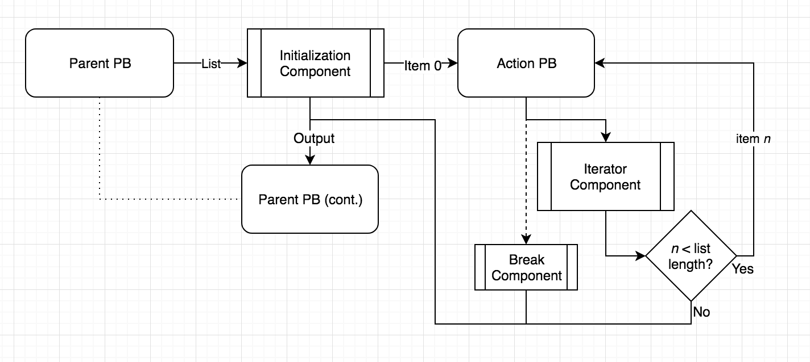
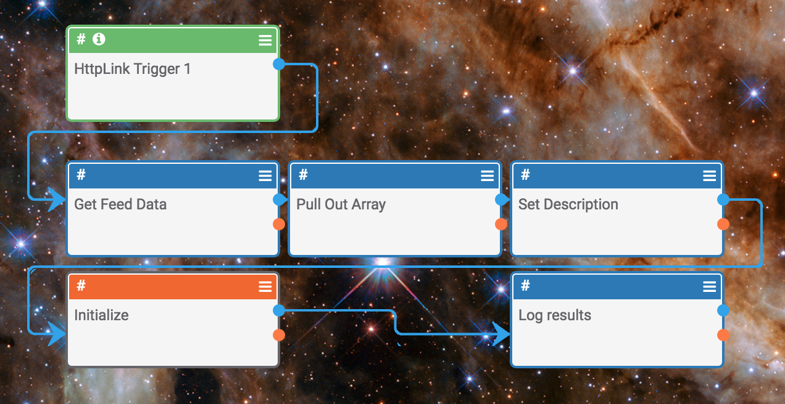
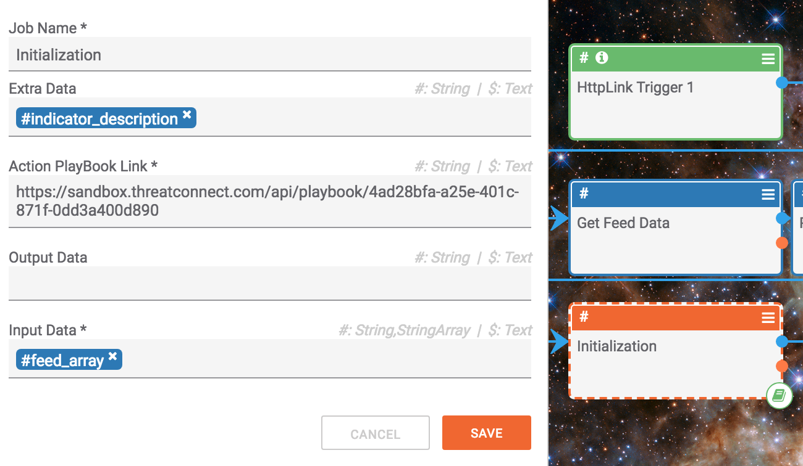
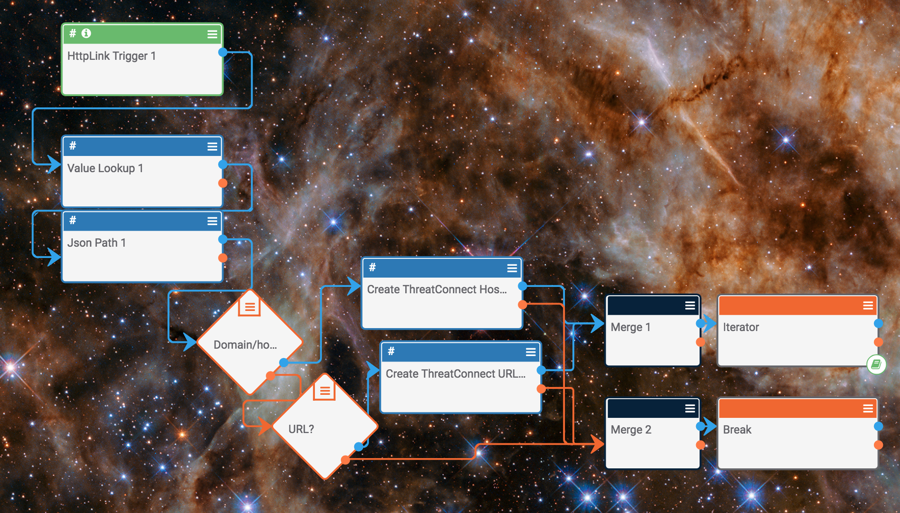
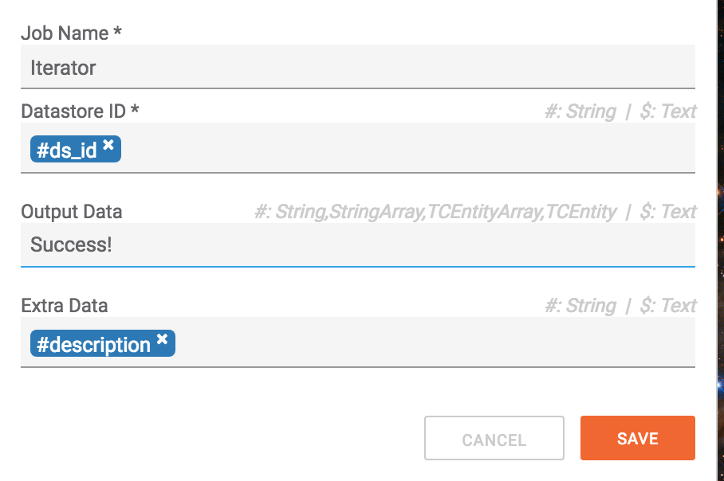
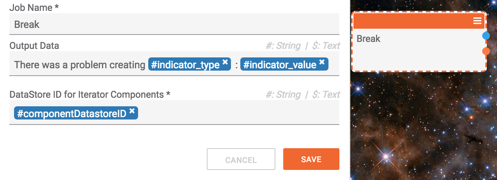

# Array Iteration

The components used in this construct are available [here](https://gitlab.com/cezhunter/Iterator_Playbook_Components/).

Iterating through arrays in playbooks (just like a basic iterator in programming) involves 3 main components:

    1. Initialization
    2. Iterator
    3. (optional) Break



We begin with a parent playbook that collects or builds some list. We then have an _action_ playbook that takes each item in the list as input. We pass the list and the url of the action playbook to the initialization component. In the action playbook we have a component to keep iterating through the list until the end of the list is reached. Optionally, the user can use the break component to exit the loop earlier if so desired. Pretty simple!

## Example Use Case

Let us begin with a basic use case. Say your boss assigns you the task of building a system to process a new intel feed and extract indicators for your organization. Let us also assume you wish to stay away from programming. Lucky for you, our iterator method in playbooks has made such a task quite trivial.


### The Data
```json
{
    "Event": {
        "info": "Update on Pawn Storm: New Targets and Politically Motivated Campaigns",
        "publish_timestamp": "1515851051",
        "timestamp": "1515850537",
        "analysis": "2",
        "Attribute": [{
            "comment": "",
            "category": "Network activity",
            "uuid": "5a5a0b04-198c-4190-9f1a-8d1cc0a8ab16",
            "timestamp": "1515850500",
            "to_ids": true,
            "value": "adfs.senate.group",
            "object_relation": null,
            "type": "hostname"
        }, {
            "comment": "",
            "category": "Network activity",
            "uuid": "5a5a0b04-4d44-463f-81a9-8d1cc0a8ab16",
            "timestamp": "1515850500",
            "to_ids": true,
            "value": "adfs-senate.email",
            "object_relation": null,
            "type": "domain"
        }
        //so on and so forth...
        ]
    }
}
```

Looking at the data feed, we see that it makes sense to iterate throught the `Attribute` list and create the appropriate indicators in ThreatConnect. We probably also want to add a short description to each one as well. Additionally, if we encounter an issue with a particular indicator, we want to stop the process and log the error.

## The Solution

Lets start with the parent playbook as such:



After fetching the data feed using an http client and pulling out the desired array `Attribute`, we set a description to be applied to each indicator and call the iterator initialization component like so...



The iterator initialization takes 4 input, some of which are optional:

1. **Action PlayBook Link** - The action playbook which will be executed on each of the items in the list.
2. **Input Array** - The array we would like to iterate through.
3. **Output Data** (optional) - Any output data we would like to pre-set. This can be useful when you want to append some results over each iteration with some initial value. Again, lets not worry about these features for now.
4. **Extra Data** (optional) - This field is meant to store some arbitrary data to be passed down to the action playbook. In this case it is being used to pass the description we would like to see applied to each indicator. However, this can become more useful if you are passing in json structs. Again, more on that later.

So far so good. Lets take a look at the action playbook doing the real work...



Nothing too complicated going on here but just make note of the things we are pulling out of the http link trigger:

- (_header_) **componentDatastoreID:** A unique DataStore ID that is required to be passed down to the iterator component (generated by initialization)
- (_body_) **item:** The current item in the array that the iterator has pointed us to

The **Get Data** component allows us to access data from the iterator's datastore (in this case we are using it to retrieve the **Extra Data** which is the description we set in the first playbook). All this component needs is the _componentDatastoreID_ that we pulled out of the link header.

After creating the appropriate data types in ThreatConnect we either keep iterating, or 'break' out of the iteration on a failure.


The configuration for the iterator component is quite simple:



We simply pass through the _componentDatastoreID_ variable and the output/extra data if we so choose. Since we are using the same description for each indicator, we pass through extra data as is. We also set the output to a simple success message. The output is eventually returned to the parent playbook.

If something goes wrong, say an indicator fails to create for whatever reason, we wish to break out of the loop and set the result to an informative error message.

For this we have the break component configured as such:


 
Again, pass through the _componentDatastoreID_ variable as required by the iterator system and set the output to an error message, which is relayed by the parent pb.

When we run this playbook, all indicators are created until one of them fails, causing execution to return to the parent playbook where the logger spits out the following as expected.

`"There was a problem creating link  :
http://blog.trendmicro.com/trendlabs-security-intelligence/update-pawn-storm-new-targets-politically-motivated-campaigns/"`

It works! The playbook components for iterating through arrays are available [here](https://gitlab.com/cezhunter/Iterator_Playbook_Components/).
