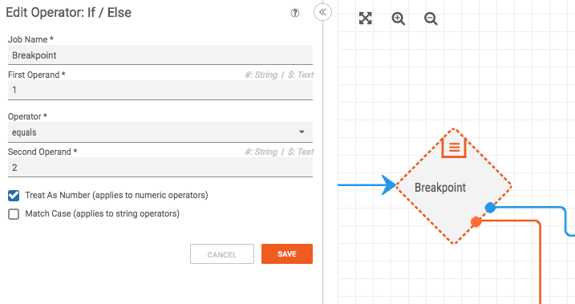
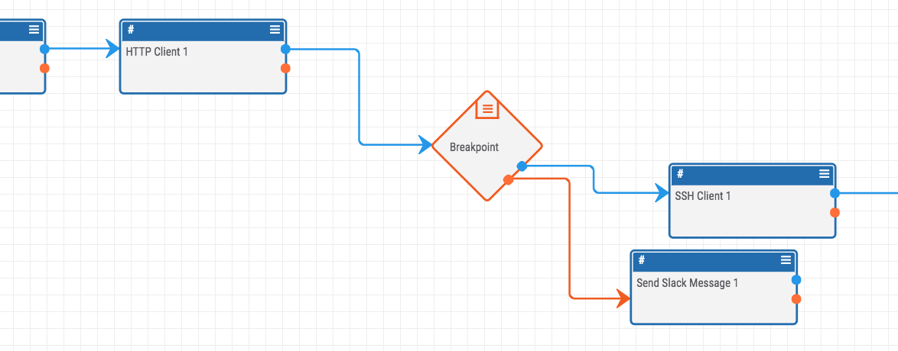

# Using Breakpoints

If you're debugging a large, complex playbook, it can be helpful to test it one section at a time. To simulate a [breakpoint](https://en.wikipedia.org/wiki/Breakpoint), you can use an "If" operator that is setup to always fail:

After the breakpoint, you can add a messaging app of some kind (slack, email, logging, etc.) to get feedback about what you have tested so far:

When you're done testing one section and want to move on, simply remove the "If" operator that acts as the breakpoint and plug it into the playbook somewhere else.
