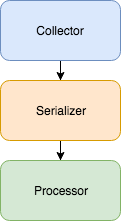

# Collecting and Processing Data in Playbooks

## The Problem

It can be very difficult to use playbooks to collect data. For example, let's say there is a json feed that looks like:

```json
[{
    "url": "https://example.com/upload/40a8c240b5f941369f2a8cfb3e11a2bd",
    "id": "40a8c240b5f941369f2a8cfb3e11a2bd",
    "truncated": false
},
{
    "url": "https://example.com/upload/736dffbb36ef50151cb87bbe4109b925",
    "id": "736dffbb36ef50151cb87bbe4109b925",
    "truncated": false
}]
```

Let's pretend we wanted to make a request to get the content at each of the URLs in the json (in this case, `https://example.com/upload/40a8c240b5f941369f2a8cfb3e11a2bd` and `https://example.com/upload/736dffbb36ef50151cb87bbe4109b925`). This is difficult. We can easily find all of the URLs in the json, but how do we make a request to each of them? This construct provides a solution any time you would like to run a playbook on each item in an array.

## The Solution

This construct describes an easy way to handle these situations using a three step process:



1. **Collect** - Find an array of things you would like to work with and send that array to the serializer.
2. **Serialize** - Go through each item of the array and send it to the processor.
3. **Process** - Do something with the given item.

## Example

Let's walk through the collect, serialize, and process steps with the json data given in the [problem](#the-problem) section.

### Collect Example

To collect the json data, we would simply make a request to the endpoint with the data. Then, we would use a json path (`[*].url`) to find an array with each of the urls. Once we have this, we would send the array (`["https://example.com/upload/40a8c240b5f941369f2a8cfb3e11a2bd", "https://example.com/upload/736dffbb36ef50151cb87bbe4109b925"]`) to the serializer along with a link to the processor we would like to use (e.g. `https://sandbox.threatconnect.com/api/playbook/14859281-a955-4c86-9805-b1771f115905`).

### Serialize Example

The serializer receives the array, breaks out each item of the array, and sends it to the processor. It will first send `https://example.com/upload/40a8c240b5f941369f2a8cfb3e11a2bd` to the processor (using the trigger link `https://sandbox.threatconnect.com/api/playbook/14859281-a955-4c86-9805-b1771f115905`) and will then send `https://example.com/upload/736dffbb36ef50151cb87bbe4109b925` to the processor. This allows the processor to perform an action on only one piece of data.

### Process Example

In this example, the processor would make a request to each link it receives.
