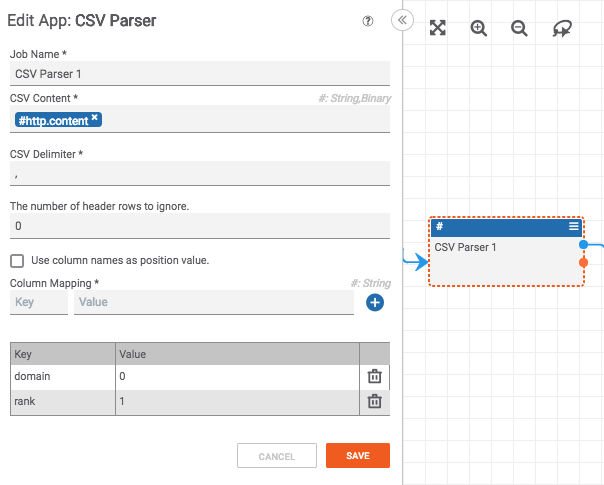
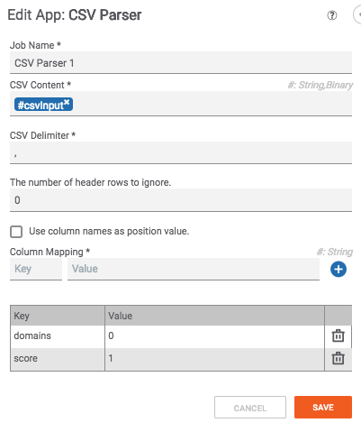

# Using the CSV Parser

The CSV Parser can be confusing to use. Here are some helpful tips for using it:



The "Column Mapping" section allows you to specify which column from the CSV (captured in the "Value" input) will be mapped to which output variable (captured in the "Key" input). In other words, the "Key" field is the name of the output variable for the column. The "Value" field specifies which column of the CSV will be selected.

If "Use column names as position value" is selected, the input in the "Value" field should be the name of a column. Otherwise, the "Value" field should be an integer between zero and one less than the number of columns in the CSV (e.g. if "Value" is 0, it will select the first column of the CSV; a "Value" of 1 will select the second column and so on).

For example, let's pretend you had a CSV of domains and a score assigned to them:

```
test1.com,1
test2.com,2
test3.com,3
test4.com,4
```

To parse this CSV, you would want to do something like:


