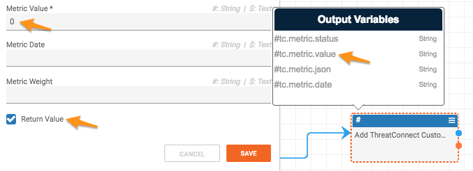

# Retrieving the Value of a Custom Metric

[Custom metrics](https://docs.threatconnect.com/en/latest/rest_api/custom_metrics/custom_metrics.html#custom-metrics) are very powerful for keeping track of counts, averages, min, max, etc for arbitrary data. This article describes how to get the value of a metric from a playbook, but first a word of caution. Currently, the only way to get the value of a custom metric is by writing data to the metric (in this case, we'll use zero). This tactic may not work for all use-cases and may pollute the data. In fact, this method is only guaranteed not to corrupt data if the custom metric is summing values.

Assuming it is acceptable to write a zero to a custom metric, here is how to retrieve the value of a custom metric:

The key points are pointed out with arrows. The basic idea is that you select the metric you would like to retrieve, send zero as the `Metric Value`, make sure to select the `Return Value` checkbox, and then you will be able to use the `tc.metric.value` variable in downstream playbooks.
