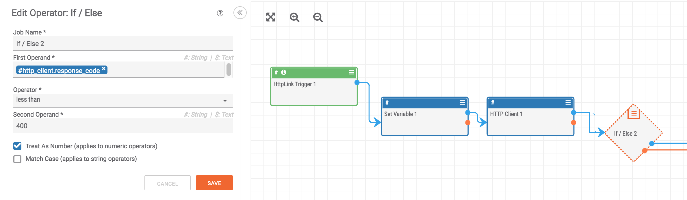

## HTTP Client Response Handling

The "HTTP Client" app is extremely powerful as it provides you access to any internet facing service. When using this app, it is important to keep in mind that if the app receives a response from the requested URL (even if that response is an error code) it will pass the response out on the blue line. As such, it is often important to include an "If" operator after an HTTP Client to filter out responses with error codes from those which were successful. Here is a helpful construct to do this:

