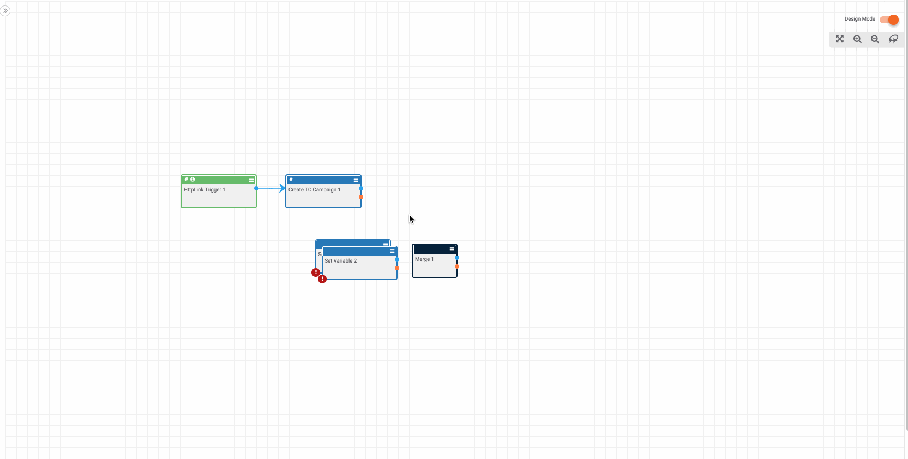

# Providing HTTP Response Codes

If you're using an "HTTP Trigger" in a playbook, it is helpful to [pass a response](https://pb-constructs.hightower.space/playbooks/constructs/trigger_passback) back to the trigger so the system which made the initial request gets a response. In short: we want to return a 200 status code if playbook works and a 500 error code if the playbook fails.

To do this, you will use two "Set Variable" apps and a "Merge" operator:

Plug one of the "Set Variable" apps into the success path for the playbook and add a variable named something like `successCode` to 200. Plug the other "Set Variable" app into the failure path of the playbook and add a variable named something like `errorCode` to 500. Now, attach a merge app to each of the two "Set Variable" apps and add two variables named something like `responseCode` that is defined as both the `successCode` and the `errorCode`. This will take either the `successCode` or the `errorCode` and record the value of the variable as the `responseCode` variable. You can read more about "Merge" operators [here](https://pb-constructs.hightower.space/playbooks/constructs/merge). Finally, you can wire the merge app back to the trigger and set the trigger's "Response Code" in the "Response Header" section to be `responseCode`.
