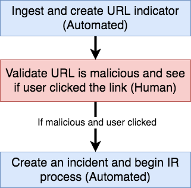

# Human-in-the-Loop Workflows with Playbooks

Many 'automated' workflows operate best when a human is involved in part of the workflow. This construct describes a simple system for designing playbooks that wait for human interaction before continuing.

## Example Use-case

This construct is designed for use cases that look something like:

For example, let's say you have an incoming stream of phishing URLs reported by your employees. You design a playbook that creates an endpoint to which each phishing URL is sent. The URL is created as an Indicator in ThreatConnect. For each reported URL, you want someone on the IR team to contact the person who submitted the domain to see if he/she clicked on the link. If he/she did click, you want to create an incident and investigate the matter further... but you need to have a human-in-the-loop to validate whether or not the user clicked the malicious link. You want a workflow that looks something like:

## Setting up a Human-in-the-Loop System

Todo: More here soon...

## Required Components

The components required to create a human-in-the-loop playbook are here: [https://gitlab.com/fhightower-tc/human-in-the-loop-pb](https://gitlab.com/fhightower-tc/human-in-the-loop-pb).
