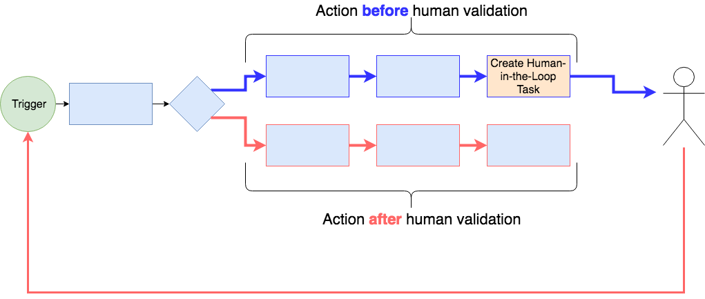

# Human-in-the-Loop Workflows with Playbooks

Many 'automated' workflows operate best when a human is involved in part of the workflow. This construct describes a simple system for designing playbooks that wait for human interaction before continuing.

## Example Use-case

This construct is designed for use cases that look something like:

Another way to think about it in playbook form is:

For example, let's say you have an incoming stream of phishing URLs reported by your employees. You design a playbook that creates an endpoint to which each phishing URL is sent. The URL is created as an Indicator in ThreatConnect. For each reported URL, you want to create a task for someone on the IR team to contact the person who submitted the domain to see if he/she clicked on the link. If he/she did click, you want to create an incident and investigate the matter further... but you need to have a human-in-the-loop to validate whether or not the user clicked the malicious link. You want a workflow that looks something like:

## How it Works

This system pulls a human into the 'loop' by creating a task in ThreatConnect. When it creates the task, the execution of the automated process that runs before human validation ends and this system records the link to the playbook that should be called when the task is completed in the [datastore](https://pb-constructs.hightower.space/playbooks/introductions/datastore). Thus, when the use completes the task using the user-action trigger included as part of this system, the task is completed and the playbook is called with a special header to let the playbook know that the human has completed the task (this way it will only run the process that should occur *after* the human has validated the process). The next section describes how to setup this system.

## Setting up a Human-in-the-Loop System

To setup a human-in-the-loop system with playbooks, you will need:

1. A component to create a human-in-the-loop task
2. A playbook that is triggered with a user-action to complete the task and continue the process

Each of these parts is described in more detail below:

### Task Creation Component

The component to create a task is available here: [https://gitlab.com/fhightower-tc/human-in-the-loop-pb/blob/master/%5BHuman-in-the-Loop%5D%20Create%20task.pbx](https://gitlab.com/fhightower-tc/human-in-the-loop-pb/blob/master/%5BHuman-in-the-Loop%5D%20Create%20task.pbx). For input, this component requires a name for the task it will create and the URL for the playbook you would like to trigger when the task is completed.

### Task Completion Playbook

To include the human in the 'loop', this system creates a task in ThreatConnect when the process is ready for human involvement/validation. Instead of completing a task like you normally would in ThreatConnect, you will need to use a special playbook which provides a user-action to complete the task and call the playbook to continue the process. This playbook is available here: [https://gitlab.com/fhightower-tc/human-in-the-loop-pb/blob/master/%5BHuman-in-the-loop%5D%20Complete%20task.pbx](https://gitlab.com/fhightower-tc/human-in-the-loop-pb/blob/master/%5BHuman-in-the-loop%5D%20Complete%20task.pbx).

## Get Started!

There is an example playbook to get you started: [https://gitlab.com/fhightower-tc/human-in-the-loop-pb/blob/master/%5BHuman-in-the-Loop%5D%20Example.pbx](https://gitlab.com/fhightower-tc/human-in-the-loop-pb/blob/master/%5BHuman-in-the-Loop%5D%20Example.pbx).

Feel free to raise any [issues](https://gitlab.com/fhightower-tc/human-in-the-loop-pb/issues) or [contact me](https://hightower.space/contact/) with any questions, comments, or ideas.
