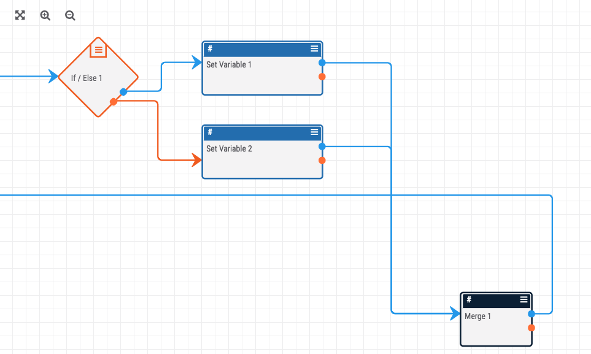

# If-Merge: Merging Conditional Paths

This construct consolidates the output of an "If" operator so that a value is available to a down-stream Playbook app regardless of the value returned by the "If" operator.

