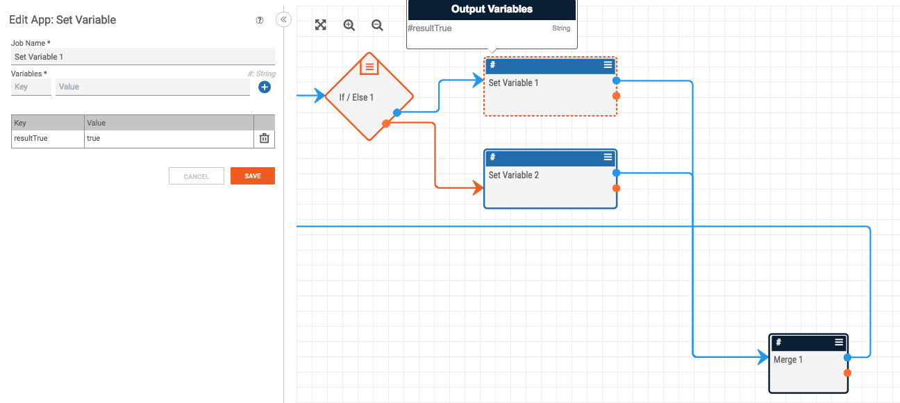
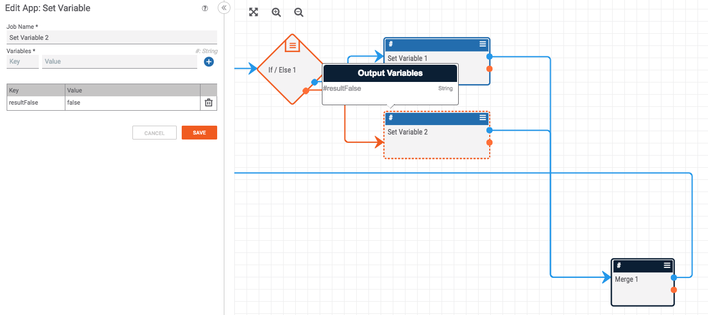
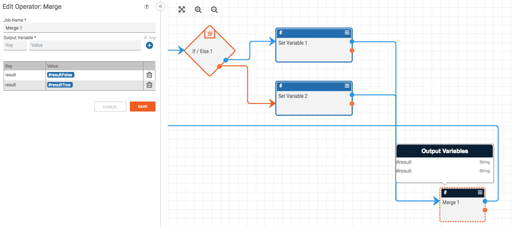
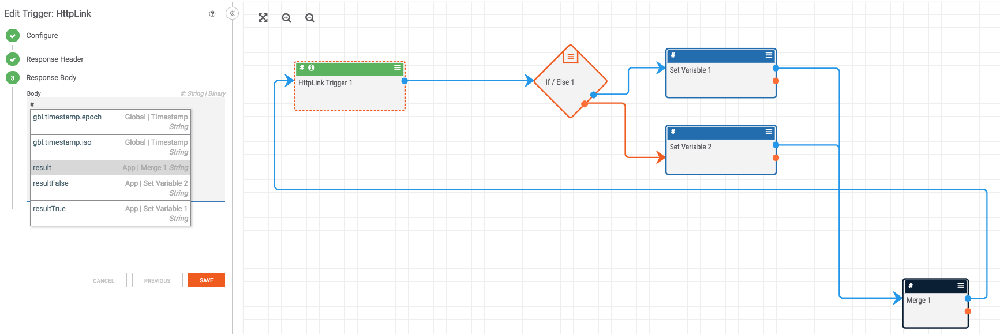

# If-Merge: Merging Conditional Paths

This construct consolidates the output of an "If" operator so that a value is available to a down-stream Playbook app regardless of the value returned by the "If" operator.

This construct involves four apps. An "If" operator, two "Set Variable" apps, and a "Merge" operator. Each of the outputs from the "If" operator (the success and failure paths) go to a "Set Variable" app where a variable is declared. If the "If" operator is successful, a "resultTrue" variable is set as shown below.

If the "If" operator fails, a "resultFalse" variable is set as shown below.

The real magic happens in the "Merge" operator where the value of either the "resultTrue" or "resultFalse" variable is passed on as the "result" variable. If the "If" statement is true, the merge app will receive a "resultTrue" variable and will pass the value of this variable on as the "result" variable. If the "If" statement is false, the merge app will receive a "resultFalse" variable and will pass the value of this variable on as the "result" variable. The image below shows how this looks in a playbook.

Using this "If-Merge" construct, the down-stream apps can use the "result" variable regardless of the success or failure of the "If" operator:

