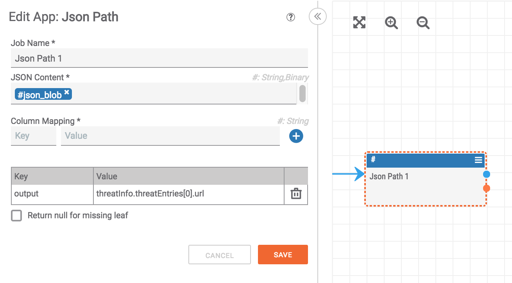

# JSON Filtering

Filtering JSON is an important part of many apps, especially those which make [HTTP requests](http_client_response_handling.html). To filter JSON, use the "Json Path" app to select a portion of the JSON.

For example, let's say you had the following JSON returned from an API endpoint (this is from the [SafeBrowsing API](https://developers.google.com/safe-browsing/v4/lookup-api)):

```
{
  "client": {
    "clientId":      "yourcompanyname",
    "clientVersion": "1.5.2"
  },
  "threatInfo": {
    "threatTypes":      ["MALWARE", "SOCIAL_ENGINEERING"],
    "platformTypes":    ["WINDOWS"],
    "threatEntryTypes": ["URL"],
    "threatEntries": [
      {"url": "http://www.urltocheck1.org/"},
      {"url": "http://www.urltocheck2.org/"},
      {"url": "http://www.urltocheck3.com/"}
    ]
  }
}
```

Let's assume we want to get the first URL in the `threatEntries` list (`http://www.urltocheck1.org/`). To do this, we would pass the JSON content into the "Json Path" app, the JSON path to select the URL, and the name of the variable we will use to pass out the identified JSON content. In this case, we will use the JSON path `threatInfo.threatEntries[0].url` as shown below:



To identify all of the urls in the `threatEntries` list, we would use the following JSON path: `threatInfo.threatEntries[*].url`.
