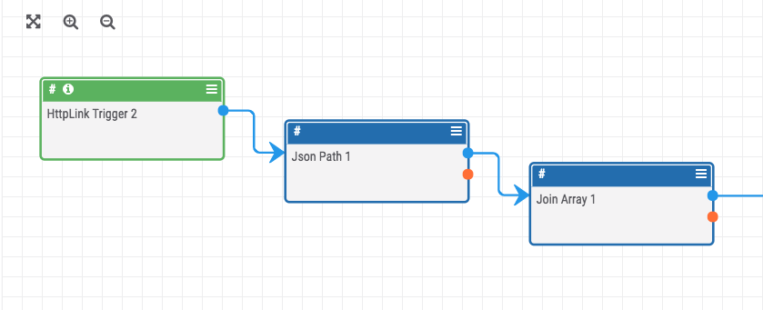
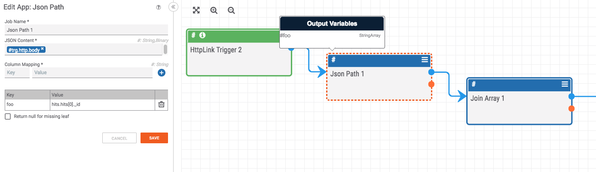

# Json-to-Join: Converting String Array to String

If you have a string array that you want to convert into a string, you can use the "Join Array" app.

This is especially helpful when you use the "Json Path" app to get one, specific result. The "Json Path" app returns values as a string array which isn't helpful if you are only trying to select a particular item from a Json blob. To get the string version of the output from the "Json Path" app, use the "Join Array" app:

The output of the "Json Path" app is a string array:

The "Join Array" app will output string array as a string:

