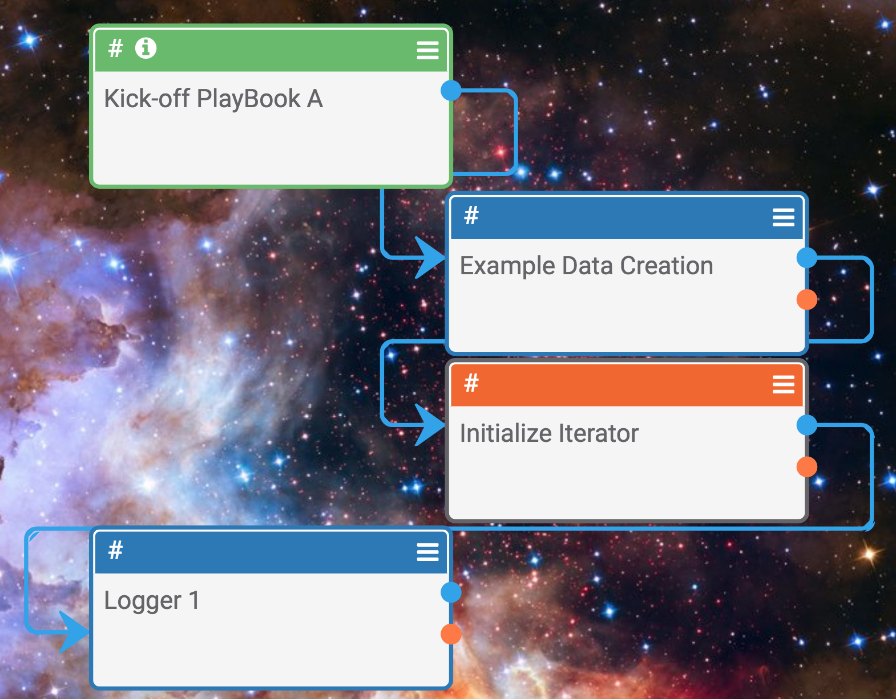
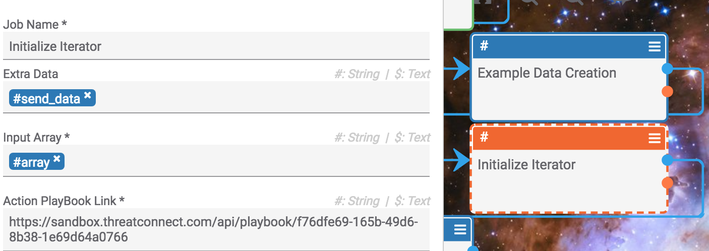
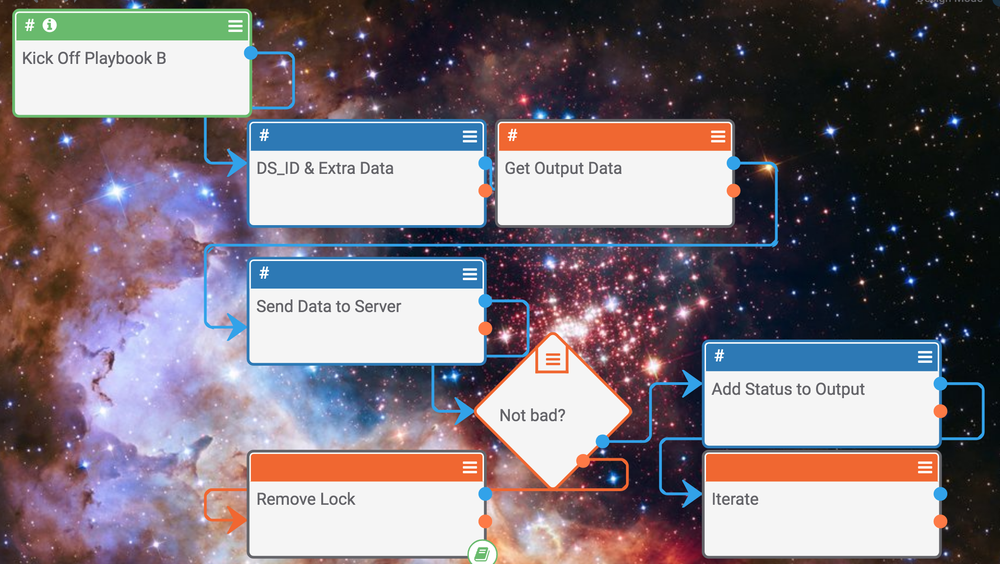
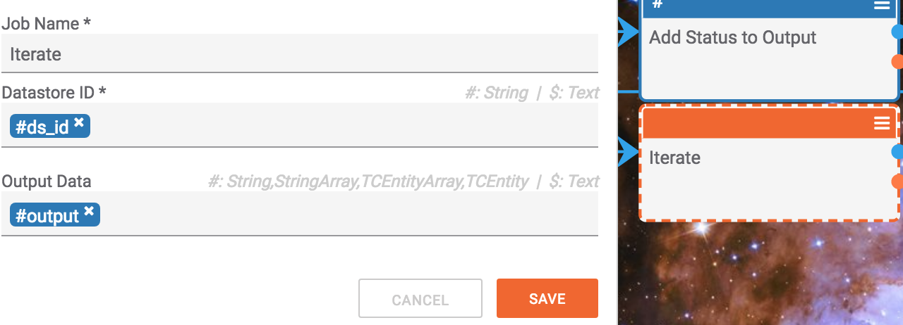
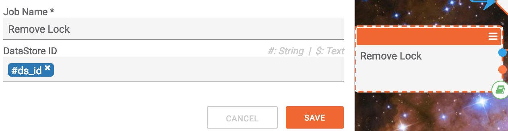

# List Iteration

## The Problem

To iterate through lists in playbooks we have 2 major components.

Let us take a very simple example. Say that you have a list of URLs and you would like to send data to each one recording the responses in a nicely formatted manner. For instance, we have generated the following list of URLs:
```json
["https://sandbox.threatconnect.com/api/playbook/eecf7c31-b38c-4e1e-b94f-fac56745c9f5",
 "https://sandbox.threatconnect.com/api/playbook/e892175c-df92-4a50-9239-83fcbb7d1e71",
 "https://sandbox.threatconnect.com/api/playbook/c51faf5e-d7e7-4391-8c5f-3f9945869448",
 "https://sandbox.threatconnect.com/api/playbook/7077869b-e569-497a-9aa0-852ee4b5ded2",
 "https://sandbox.threatconnect.com/api/playbook/7077869b-e569-497a-9aa0-3f9945819448"]
```
and now we need to send some data (lets just say hello for now) and record the response, stopping execution if we get a bad response. 

_Server 1 sends back "good", 2 sends "ok", 3 also sends "good", and 4 sends "bad"_

## The Solution

The solution assumes that two playbooks exist:
    1. The parent playbook which creates or obtains the list
    2. The action playbook which _acts_ on each item of the list

Lets start with the parent playbook as such:



Nothing too interesting going on here. We are just taking in the list from the body of http link (the method of obtaining or generating a list is negligable here) and are setting a variable to hold the data we would like to send ("hello"). The logger is used to log the output of the list iteration process (server responses). Please notice how the Iterator Initialization Component is configured:



1. **Extra Data** - This field is meant to store some arbitrary data to be passed down to the action playbook. In this case it is being used to pass the data we would like to send to each server.
2. **Input Array** - The array we would like to iterate through.
3. **Action PlayBook Link** - The action playbook which will be executed on the items (URLs).

So far so good. Let us take a look at the action playbook:



Again, nothing too complicated. The individual item (URL) is being passed via body of the http link trigger, the extra data ("hello") is being pulled out of the header of the http link and the user just needs to pass along the DataStore ID to the iterate component. Everything in between is up to the user. For now we are just sending "hello" to the url and, if it is not a "bad" response, concatenating the response to the output. If it is a bad response we have a remove lock component which will be explained shortly but for now lets take a look at the core component, Iterate.


 
Thats it. Just pass it the DataStore ID and (any) results generated.

The remove lock component is even simpler. It is responsible for communicating with the calling component (initialize iterator) to stop waiting for the iteration to complete and to resume execution in the parent playbook. Otherwise, if never called, the iterator will keep going until the end of the list is reached (naturally).



Just pass the DataStore ID to remove the lock.

At the end, the logger in our parent playbook prints the following:

`Server Satus was good - Server Satus was ok - Server Satus was good -`

Voila! Each response corresponding to the URLs in the list.