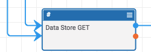
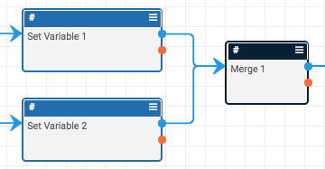
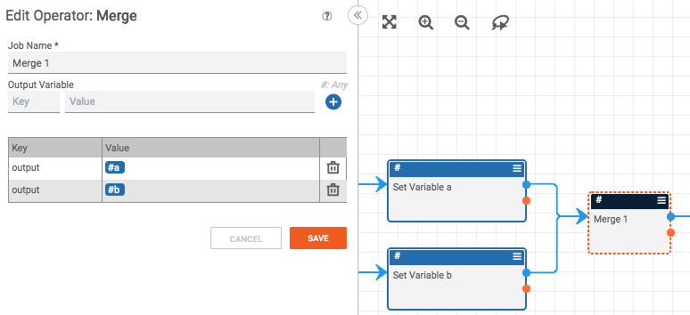
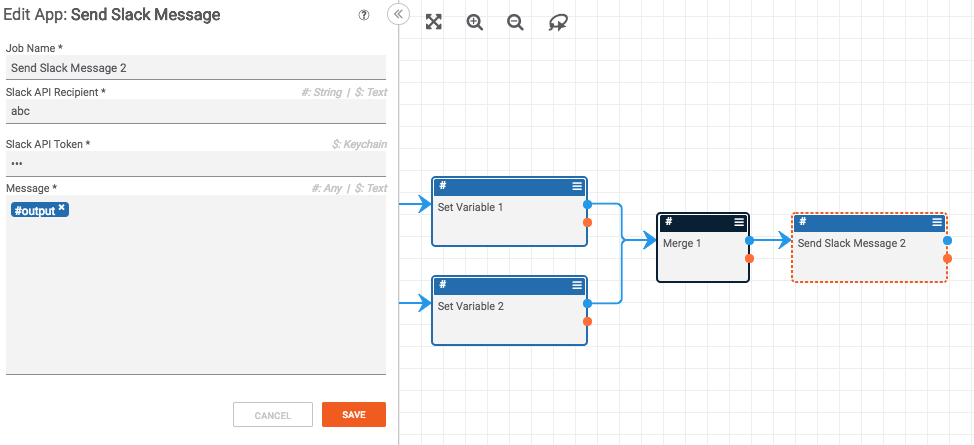

# Using the Merge Operator

By default, an app that has two inputs will wait until it has both inputs before executing. Thus, the app below will not execute until both of the two, blue inputs are available.

This poses a challenge if you want to have multiple, possible paths in a playbook. To solve this problem, you need to use the "Merge" operator. The "Merge" operator is different than other apps in that it executes when it receives the first input (even if there are multiple, possible inputs).

To make the "Merge" operator more powerful, it is also possible to pass variables through the merge app. For example, in the app below, the inputs from the two different branches are set to one variable named `output`.

This means that no matter which path through the playbook is used (regardless of whether the path goes through the "Set Variable a" or the "Set Variable b" apps), the merge app will select the appropriate value for the `output` variable and make it available to downstream apps. For example, if the playbook runs through the "Set Variable a" app, the merge app will set the `output` variable to the value of the variable `#a`. If the playbook runs through the "Set Variable b" app, the merge app will set the `output` variable to the value of the variable `#b`.

Downstream apps can then use the output of the merge app as shown below.

