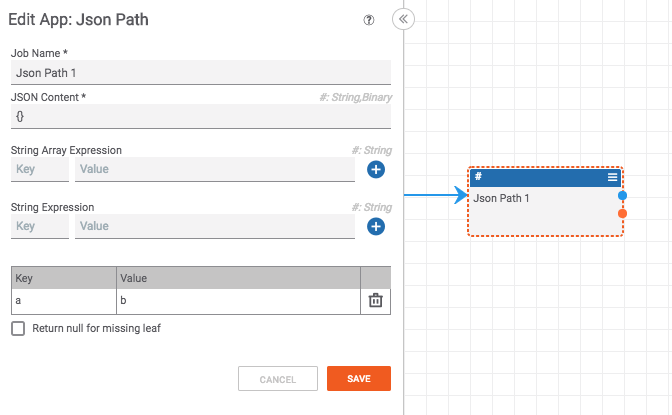

# Making a PB Fail

If you need a playbook/component to fail, I like to a JSON path app like:

**Note:** If you use this strategy, be sure to name the app in a way that makes it clear what you are doing. That way, people who come along later won't be completely lost.
