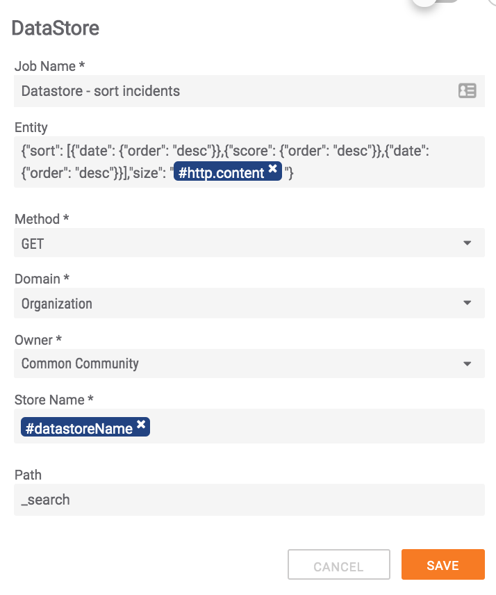

# Sort Datastore Content

You can sort data in the datastore using elasticsearch as described here: [https://www.elastic.co/guide/en/elasticsearch/reference/6.0/search-request-sort.html](https://www.elastic.co/guide/en/elasticsearch/reference/6.0/search-request-sort.html).

