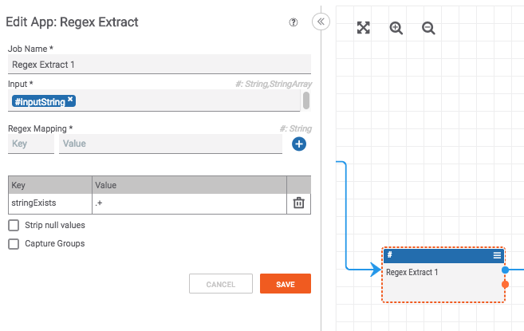
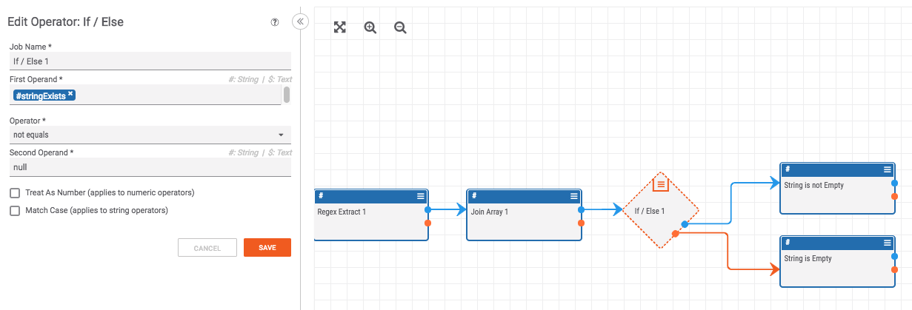

# How to Check if a String is Empty

To identify is a string is empty use the following construct:

Pass a string value into a "Regex Extract" app that check for the regex `.+` (which will match any string that has at least one character).

Then, join the string array output from the regex app (this [converts the string array to a string](./json_to_join.html)). Then run it through an "If" operator that checks if the string is not equal to `null`.

This works because the "Regex Extract" app will return `null` if there was no match for the regex (in this case, `.+` which means the string is empty).
