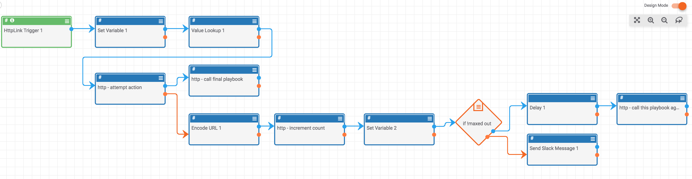
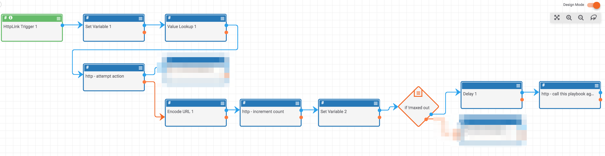
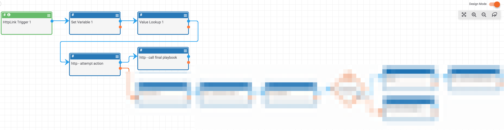

# Try Until Complete

There are many instances in which you want to keep trying something until it is done (or just want to wait until certain conditions are met). This construct provides a way for you to do this.

You can find a link to the playbook and its documentation [below](#links).

For now, we'll walk through the app to get an idea of how it works. Here is the full playbook:

The basic flow of this playbook is:

1. Attempt an http request to the playbook specified by the `link` URL query parameter.
2. If the http request from step 1 works:
    - Make a request to `finalLink`
3. If the http request from step 1 does not work (returns 40X error):
    - Increment the `count` which keeps track of the number of times we have tried to trigger the other playbook
    - If the `count` is less than the `max` number of attempts: wait for twenty seconds and make another attempt
    - If the `count` is equal to the `max` number of attempts: stop and send a message (by default, a slack message)

So we first make a request to another playbook. The idea is that we have two playbooks, but we don't want to run the second playbook until the first one is successful. So, we'll make a request to the first playbook; if the first playbook fails (and returns some kind of 400 response), we'll increment the counter which keeps track of how many times we have made the request, wait for some time (20 seconds by default), and then try again. You can see this flow below (the inconsequential playbook apps for this process are blurred):

Eventually, we will want to stop requesting the first playbook and give up (so we don't get stuck making requests for sempiternity). There is a `max` value that you send the app to tell it when to give up. If the playbook has tried the maximum number of times, it will fail and send a slack message (you can configure it to send a message in a different medium). This flow looks like:

If we request the first playbook for a bit and then it finally succeeds before the maximum number of requests are made, then a request is made to the playbook at the `finalLink`. This flow looks like:

## Links

You can find documentation for the playbook to support this construct [here](https://tc.hightower.space/post/playbooks/repeat_until_success/).

You can find the actual playbook [here](https://github.com/ThreatConnect-Inc/threatconnect-playbooks/tree/master/playbooks/repeat-until-success).

I have a playbook to do this described here:  . I call it the "Repeat Until Successful" playbook (not the best name, but that's not important).

Basically, it makes a request to another playbook (we'll call it "Playbook A"); if Playbook A fails, the Repeat Until Successful playbook will wait for a certain amount of time and then try the request again until Playbook A succeeds (there is a counter in the Repeat Until Successful so that it won't keep trying to run Playbook A forever). If playbook A succeeds, 

https://sandbox.threatconnect.com/api/playbook/9adeeff8-5a23-4d89-bcd5-98102105f2b8?max=10&count=0&link=https://sandbox.threatconnect.com/api/playbook/a2d8406d-e0d8-4199-ba80-1bfb439360d0&finalLink=https://sandbox.threatconnect.com/api/playbook/638049bb-a3b3-4b37-92ea-07e762b4ef76
