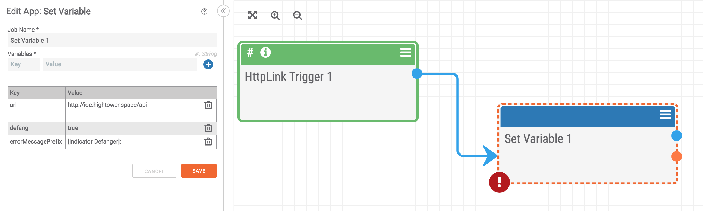

## Variable Initialization

It is a good idea to have a "Set Variable" app near the beginning of your playbook so you can easily manage the variables used throughout the playbook. Doing this one, small step can save you a lot of time in the long run if you need to add or update variables later.

