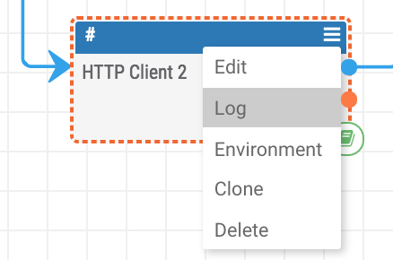
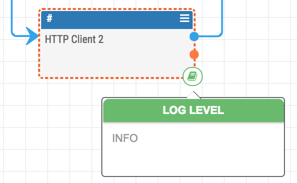

# Gotchas: Common Mistakes and Errors

- Do **NOT** leave a playbook running with a logging level of `DEBUG` or `TRACE` if you are not actively debugging the playbook. This unnecessarily eats up memory and can limit the performance of other playbooks. Be sure to raise the logging level when you are done debugging a playbook. Alternatively, you can also change the logging level of a single playbook app or a section of the playbook:





- A "Merge" operator only takes inputs of the same type.
- When storing content as JSON in the datastore, make sure the JSON has double-quotes.
- If you run into an error creating an indicator, check out the list of [common errors](https://docs.threatconnect.com/en/latest/common_errors.html#creating-indicators) in the documentation.
- If you are rendering html with javascript in a tip as the response from a "UserAction" trigger, [strict mode](https://developer.mozilla.org/en-US/docs/Web/JavaScript/Reference/Strict_mode) is turned on which means that a missing semicolon at the end of a line or undeclared variable (or some other error) will throw an error when the playbook is run. Comments also do not work in the javascript that is rendered as a tip. If you include comments in the javascript which gets rendered, it will throw an error.
- Some playbook apps (including the "Date Format" app and "Set Variable" app) fail if you try to use a variable with a string before or after it. For example, if I have a variable named `url` and try to create a new variable by typing `#url/test.php`, this will fail with an error message like "Job 'Set Variable 1' has an invalid variable reference in parameter 'Variables'.".
- Apps like the "Get ThreatConnect Group" and "Get ThreatConnect Indicator" apps only return 100 results.
- The "Data Store" app only returns 10 results from the datastore by default. To change this, include a key value pair like the one below in the request body:
  ```
  "size": 50
  ```
