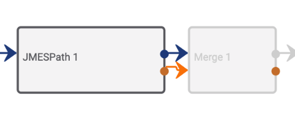

# Gotchas: Common Mistakes and Errors

- Do NOT leave a playbook running with a **logging level** of `DEBUG` or `TRACE` if you are not actively debugging the playbook. This unnecessarily eats up memory and can limit the performance of other playbooks. Be sure to raise the logging level when you are done debugging a playbook. Alternatively, you can also change the logging level of a single playbook app or a section of the playbook:


- A "**Merge**" operator only takes inputs of the same type.
- If you run into an **error creating an indicator**, check out the list of [common errors](https://docs.threatconnect.com/en/latest/common_errors.html#creating-indicators) in the documentation.
- If you are **rendering html with javascript** in a tip as the response from a "**UserAction**" trigger, [strict mode](https://developer.mozilla.org/en-US/docs/Web/JavaScript/Reference/Strict_mode) is turned on which means that a missing semicolon at the end of a line or undeclared variable (or some other error) will throw an error when the playbook is run. Comments also do not work in the javascript that is rendered as a tip. If you include comments in the javascript which gets rendered, it will throw an error.
- Some playbook apps (including the "**Date Format**" app and "**Set Variable**" app) fail if you try to use a variable with a string before or after it (a nested string variable). For example, if I have a variable named `url` and try to create a new variable by typing `#url/test.php`, this will fail with an error message like "Job 'Set Variable 1' has an invalid variable reference in parameter 'Variables'.".
- Similar to the issue above, most apps cannot resolve a **string array variable** that is nested in other text. For example, when creating content in the [datastore](https://pb-constructs.hightower.space/playbooks/introductions/datastore), it is not possible to store content like:
  ```
  {
  "input_data": #stringArray
  }
  ```
  In order to store content like this, you would need to use an app like the one here: [https://github.com/ThreatConnect-Inc/threatconnect-playbooks/tree/master/apps/TCPB_-_JSON_Builder](https://github.com/ThreatConnect-Inc/threatconnect-playbooks/tree/master/apps/TCPB_-_JSON_Builder) to the create the json which gets created in the datastore or join the array and store the array as a string in the datastore.
- Apps like the "**Get ThreatConnect Group**" and "**Get ThreatConnect Indicator**" apps only return 100 results.
- If you have a playbook that **triggers when a document is created**, it is possible that the playbook will run before the content of the document is uploaded. Thus, if you have a playbook that is triggers when a document is created and need the document's contents, you may need to add a delay and re-request the document to get its contents.
- When requesting a playbook using an HTTP Trigger link, make sure the trigger does **not** have a `/` at the end of the link. Trying to trigger a playbook with the following links **will not work**: `https://my.threatconnect.com/api/playbook/123456/`, `https://my.threatconnect.com/api/playbook/123456/?id=2`. The following links **will work properly**: `https://my.threatconnect.com/api/playbook/123456`, `https://my.threatconnect.com/api/playbook/123456?id=2`.
- Passing **the success and failure paths from the same app** into another app/operator (even the merge operator) will not work.



## Datastore Gotchas

- The "**Data Store**" app only returns 10 results from the datastore by default. To change this, include a key value pair like the one below in the request body:
  ```
  "size": 50
  ```
- When storing content as **JSON** in the **datastore**, make sure the JSON has double-quotes.
