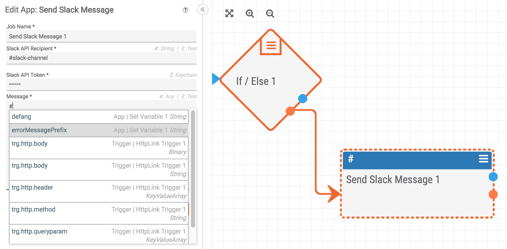
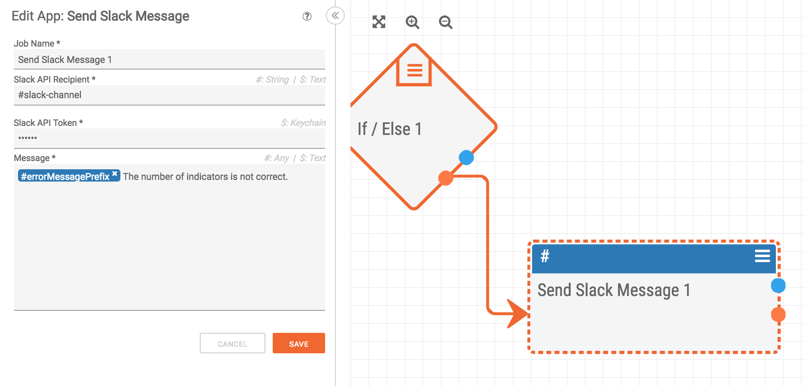

# Quality Error Messages

First things first: design your playbooks such that they notify you (maybe via logs, slack, email, etc.) when something fails. In the long run, it will make your life easier. Assuming you are already doing this, it is important to send quality error messages that let you and your team know which playbook failed. This paradigm describes one way to make this easy.

Let's consider a playbook that adds a tag to certain Indicators as they are created in ThreatConnect. Now let's pretend this playbook fails and sends an error message like "Unable to add tag to indicator". In the context of this playbook, it may make perfect sense, but what happens when you have twenty playbooks running and the person who created the playbook is on vacation? Suddenly, this error message doesn't make a lot of sense and it becomes difficult to track down which playbook had the error.

To avoid this ambiguity and to provide more context to error messages, I recommend every playbook have a [variable initialized](/constructs/variable_initialization.html) at the beginning of the playbook which serves as a prefix for all of the error messages. Thus, every error message from the playbook we discussed earlier (the one that tags Indicators) would be prefixed with something like `[Indicator Tagger]: `. This helps everyone on a team be able to identify not only *what* went wrong, but also *where* it went wrong.

A "Set Variable" app with an error message prefix looks something like:

Then, every error message for the rest of the playbook can be prefixed with the error message:

