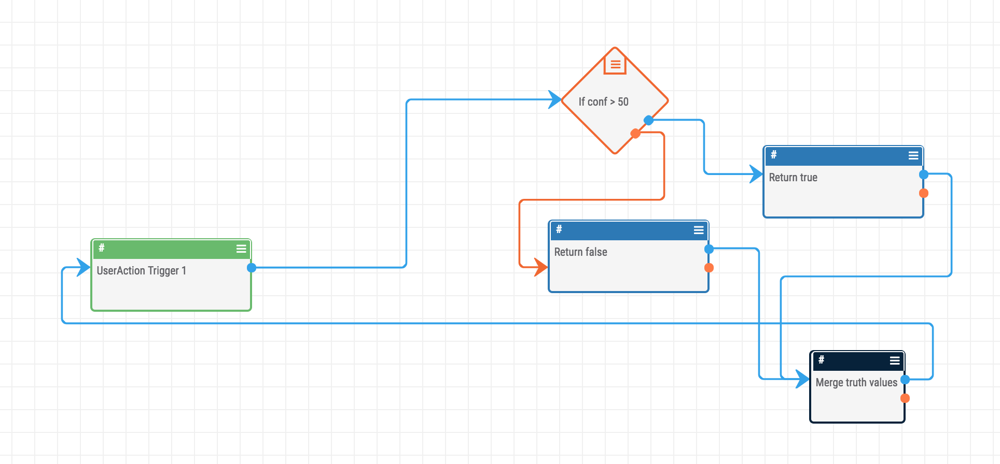
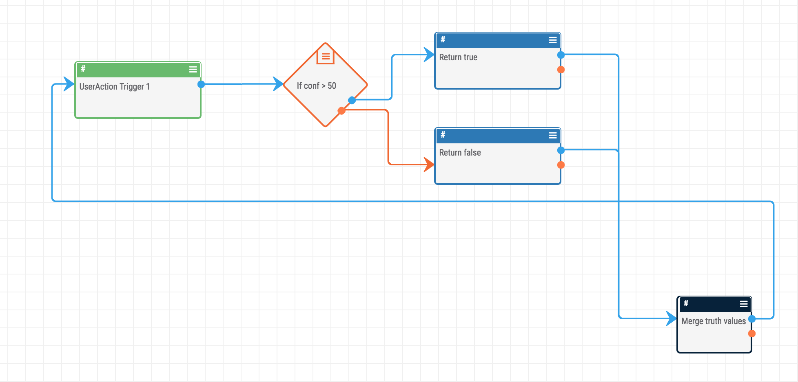

# Layout

Given the visual nature of Playbooks, designing them in a way that is visually appealing and communicative can be a challenge. I suggest designing Playbooks based on the way we (Germanic/Romance Language speakers) read: **Left to Right** and **Top to Bottom**. Ideally, each 'step' or 'process' of the playbook should be on its own line.

For example, consider the two layouts of the same playbook below:

The second playbook is more neat and clean which will make the playbook much more comprehensible and maintainable in the long run. Also, using this layout strategy makes it possible to create large Playbooks like the [webpage monitor](https://raw.githubusercontent.com/fhightower/page-monitor-playbook/master/_images/pageMonitor.png) in a way that makes sense.
