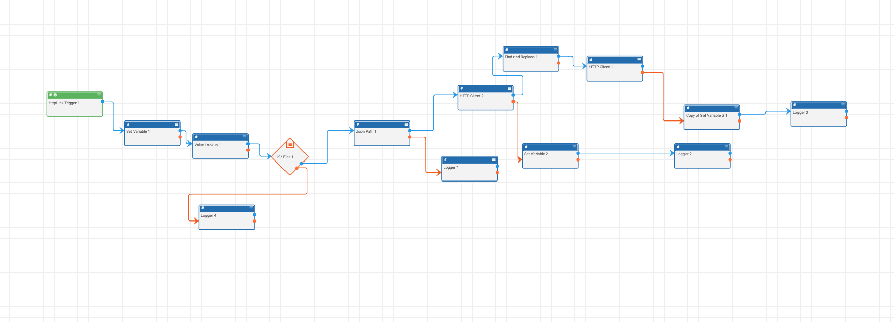
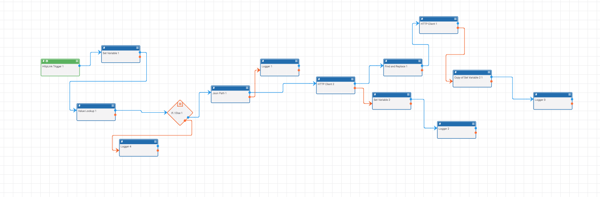

# Layout

Given the visual nature of Playbooks, designing them in a way that is appealing and communicative can be a challenge. I suggest designing Playbooks based on the way we (Germanic/Romance Language speakers) read: **Left to Right** and **Top to Bottom**. Ideally, each 'step' or 'function' in the playbook should be on its own line.

For example, consider the layouts of the same playbook below:

The last playbook is more neat and clean which will make the playbook much more comprehensible and maintainable in the long run.
