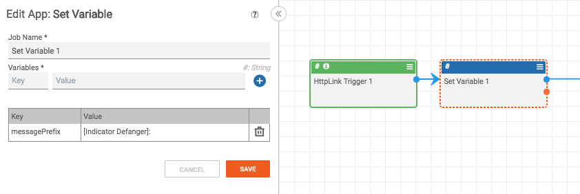
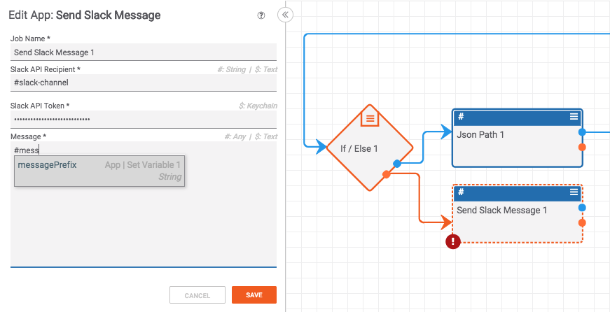
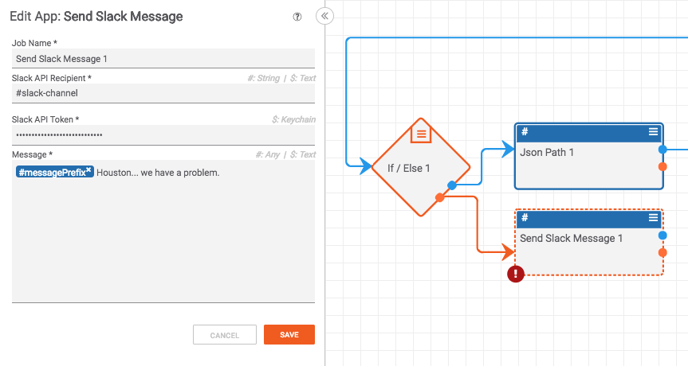

# Quality Messages

It is common for a playbook to send information out of itself in the form of an email, slack message, or [notification](https://kb.threatconnect.com/customer/en/portal/articles/2943801-notifications-and-following). To avoid ambiguous messages (especially when you have multiple playbooks running), it is important to know which playbook the message is coming from. To do this, I recommend adding a prefix to every message.

## Why

If you're not convinced why adding a prefix to messages coming from a playbook is important, consider the following use-case.

Let's consider a playbook that adds a tag to certain Indicators as they are created in ThreatConnect. Now let's pretend this playbook fails and sends an error message like "Unable to add tag to indicator". In the context of this playbook, it may make perfect sense, but what happens when you have twenty playbooks running and the person who created the playbook is on vacation? Suddenly, this error message doesn't make a lot of sense and it becomes difficult to track down *where* the error occurred.

## How

To make sure you can identify where each message came from, I recommend adding a prefix to every message. Assuming you are [initializing variables](https://pb-constructs.hightower.space/playbooks/constructs/variable-initialization) in your playbook (which you should be), you can initialize a message prefix as shown below:

You can then add this to the start of every message you send from the app:

