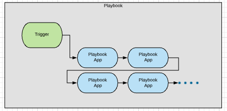
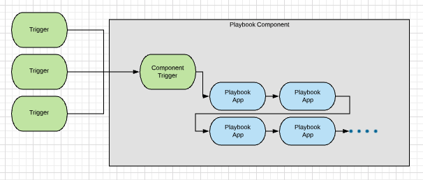

# Structuring Playbook Systems

When structuring a playbook system, you have a lot of options for how you lay it out. As a general rule, you should **design the system in a way that is interface-agnostic** (which usually means either **make it a component** or **use an http link trigger as the primary interface**). Here's an example to demonstrate what I mean:

Let's say you want to write a playbook to [triage false positives](https://tc.hightower.space/post/playbooks/false-positive-triage/). You could lay this system out like:

This layout is pretty normal. You create a playbook with a specific kind of trigger within it. The problem with this strategy is that it is difficult to use that playbook with a different trigger. What if you used a user-action trigger, but now you want to use an http link trigger to use the same functionality? We don't want to have two copies of the same playbook running around just with different triggers, so we have a problem.

A better paradigm is to design playbooks as playbook components (if possible) and then create playbooks with different triggers that interface with this playbook component:

This way, you can have a user-action trigger and http link trigger that use the same playbook component. If you can't make your playbook into a component, I recommend using an http trigger link and then adding other playbooks to hit this trigger link. Basically, I *almost never* recommend making a playbook where the main interface is anything other than an http link trigger.
