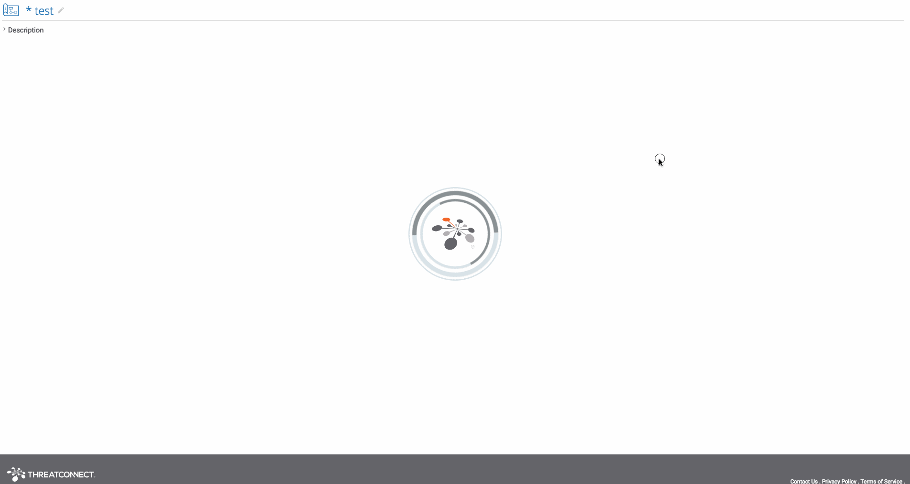
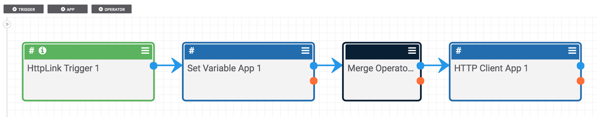
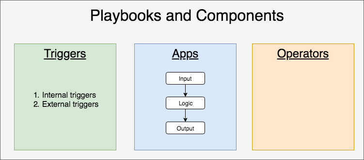

# Definitions

When learning playbooks, there are a few important definitions and classifications to keep in mind. On this page, we're going to start at a high level and work our way down.

## Playbooks and Components

There are two 'things' that can be created. **Playbooks** and **components**.

On a basic level, **Playbooks** capture a process made up of smaller operations. **Components** are similar to playbooks in that they are made up of smaller operations; the main differences between components and playbooks are:

- A component are designed to be used within a playbook or other component (they aren't accessible to the outside world like a playbook)
- Components are designed to capture useful processes that may be used in multiple other playbooks and other components. In this sense, components are like functions or methods in computer programming.

You can read more about components [here](https://kb.threatconnect.com/customer/portal/articles/2927890).

## Tiggers, Apps, and Operators: Parts of a Playbook/Component

If we were to zoom in on a specific playbook or component, that playbook/component would be made up of smaller steps. Those steps would fall into one of three types:

1. Triggers: These start a playbook/component (a component has a specific type of trigger)
2. Apps: These typically take input, perform an action, and provide some output
3. Operators: These provide functional capabilities like comparisons and [merge](https://pb-constructs.hightower.space/playbooks/constructs/merge-operator)

Every playbook or component starts with a trigger and has at least one app. It may also contain operators.

Here is a helpful picture detailing these basic classifications:

### Triggers

Triggers come in two varieties:

- Internal Triggers: These are triggers that occur when something happens inside of ThreatConnect (like an indicator/group being created or a [user-action trigger](https://kb.threatconnect.com/customer/portal/articles/2773809) being clicked by a user)
- External Triggers: These are triggers which are started from something outside of ThreatConnect (like a timer or an http link trigger)

### Apps

Apps are the meat of a playbook. They are the small operations that are combined to automate a process. Almost every app has three steps to it:

- Input: Data that will be given to the app
- Logic: Do something with the input
- Output: Create some data which can be used by subsequent playbook apps and components

There are a variety of apps and I'll just let you explore them. It is also possible to [create your own playbook app](http://tcex.hightower.space/).

### Operators

There are a variety of operators which come in handy when you start making relatively complex playbooks. I'll let you explore the list of operators on your own. You can read more about the "Merge" operator at [https://pb-constructs.hightower.space/playbooks/constructs/merge-operator](https://pb-constructs.hightower.space/playbooks/constructs/merge-operator).

## Passing Data: Blue and Orange

When connecting playbooks together to pass data and create an execution path, keep in mind that there are two outputs to every app and operator. One is blue and one is orange. If the app/operator succeeds, the execution is passed along the blue line. If it fails, execution follows the orange line.
