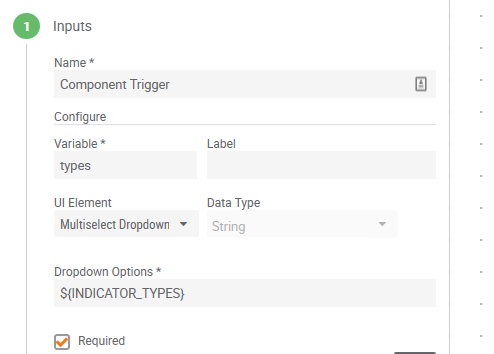

# Helpful Tips and Tricks

- If you are working with the **Datastore**, there is an introduction to it [here](https://pb-constructs.hightower.space/playbooks/introductions/datastore). There are gotchas [here](https://pb-constructs.hightower.space/playbooks/gotchas#datastore-gotchas).
- When using a **regex** in the "**Find and Replace**" playbook app, you can use `$1`, `$2`, etc. in the replace value to insert matched groups. For example, if you find the regex `(\S)\.(\S)`, this will find a non-whitespace character, followed by a period, followed by a non-whitespace character. Let's say you wanted replace the period with `[.]` (perhaps you are [defanging](https://ioc-fang.github.io/) indicators). To do this, you can use `$1[.]$2` as the replace value. The `$1` will be replaced with the non-whitespace character before the period and `$2` will be replaced with the non-whitespace character after the period.
- There is a website with some helpful resources at [http://playbooks.hightower.space/](http://playbooks.hightower.space/).
- The following 'magic variables' can be used in playbooks:

```
// pulls the list of organizations and directly resolves to the organization name.
${OWNERS}

// pulls the list of system attributes and directly resolves to the attribute value.
${ATTRIBUTES}

//pulls the list of all default and custom indicator or group types respectively
${INDICATOR_TYPES}
${GROUP_TYPES}

//resolves to metrics
${METRIC_KEYED}
${METRIC_NON_KEYED}
${METRIC_ALL}

// pulls the list of api users for the given organization and resolves to the user's userName.
${API_USERS}
```

These can be used like:


